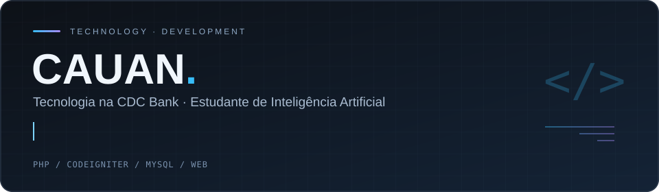

  

  

  

  

  

  

  

  

  

Sobre os projetos · versão em texto

**Cauan — profissional de tecnologia na CDC Bank.** Projetos pessoais de desenvolvimento web e integração com bancos de dados.

- [Biblioteca digital](https://github.com/cauanjbr/curso-codeigniter): catálogo público, autenticação, gerenciamento de livros e usuários, upload de capas, autoria e resumos. PHP, CodeIgniter 3, MySQL e Bootstrap.
- [Site ADV](https://github.com/cauanjbr/site-adv): projeto de site com HTML.
- [Gitrepo2](https://github.com/cauanjbr/gitrepo2): exercícios de desenvolvimento e versionamento com HTML, Git e GitHub.

